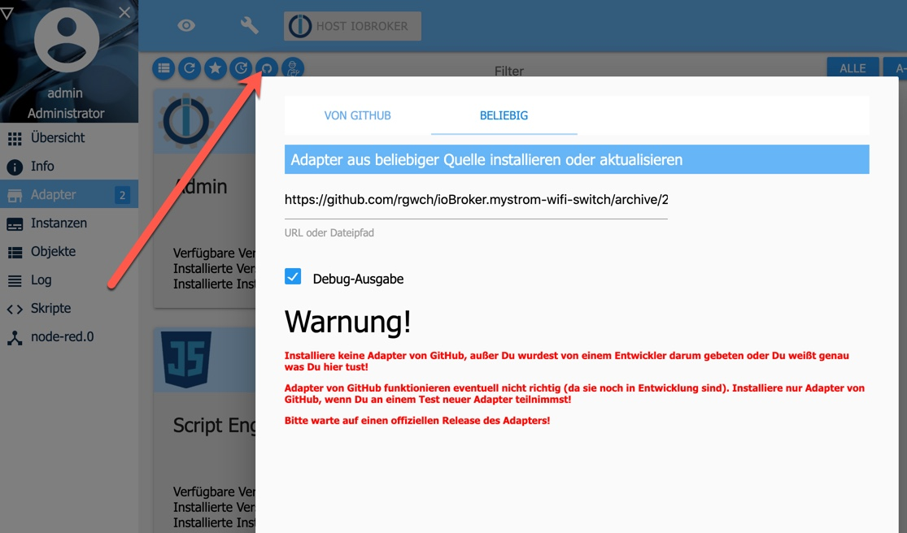

 

# ioBroker.mystrom-wifi-switch

Note: This is a complete rewrite of the original adapter v1.x, now based on the great [@iobroker/create-adapter](https://github.com/ioBroker/create-adapter) tool.

## What it is

This adapter connects [myStrom WiFi Switches](https://mystrom.ch/wifi-switch) to ioBroker.

## Install

This adapter is not part of the official ioBroker distribution. So it will not show up in ioBroker admin's adapter list. You can install it either directly from NPM:

or as a custom adapter from the admin-ui. Make sure to select "Beliebig" even though it's located at Github:

Find out the release you're interessed in: <https://github.com/rgwch/ioBroker.mystrom-wifi-switch/releases> and copy/paste the address of the .tar.gz link.

Read the warning and click "install" if you agree.

The adapter should then be in the admin pages's list.

Click on the **+** sign on the right as usual to create an instance. The Config will ask you for the IP Address of the switch to manage, and for the polling interval in seconds.
That's all. If you have several switches, just create several instances.

## Use

Each instance will create a info, a switchState and a switchPower object. SwitchState is true or false, switchPower is in Watts (and will always be 0 if  switchState is false, of course). Newer models of the switch feature an additional temperature indicator. With older switches, this will always be 0. The info.connection displays the connection state of the instance. this correlates to the "green" indicator on the instances page. The info.descripion is writeable to give the device a meaningful name.

SwitchState is writeable.

## Changelog

#### 2.0.5 and 2.0.6

* Less log messages.
* Does not turn off switch on (re)start.

#### 2.0.4

* Important bugfixes. Update is recommended.

#### 2.0.0

* complete rewrite in typescript, based on @iobroker/create-adapter

#### 1.1.1

* Update Node 12, small fixes
* Corrected size of logo
* updated copyrights

####  1.0.0
 
* Added Datapoints for Temperature (Thanks to @hhindriks)
      
####  0.10.0
   
* added admin/index_m.html (compatibility with Admin3)
         
        
#### 0.8.3

* (rgwch) changed name to mystrom-wifi-switch, since no other mystrom devices are supported by now.

#### 0.7.0

* (rgwch) added power sensor

#### 0.6.0

* (rgwch) Converted to myStrom wifi switch adapter

## License
The MIT License (MIT)

Copyright (c) 2017-2020 rgwch <rgw@rgw.ch>

Permission is hereby granted, free of charge, to any person obtaining a copy
of this software and associated documentation files (the "Software"), to deal
in the Software without restriction, including without limitation the rights
to use, copy, modify, merge, publish, distribute, sublicense, and/or sell
copies of the Software, and to permit persons to whom the Software is
furnished to do so, subject to the following conditions:

The above copyright notice and this permission notice shall be included in
all copies or substantial portions of the Software.

THE SOFTWARE IS PROVIDED "AS IS", WITHOUT WARRANTY OF ANY KIND, EXPRESS OR
IMPLIED, INCLUDING BUT NOT LIMITED TO THE WARRANTIES OF MERCHANTABILITY,
FITNESS FOR A PARTICULAR PURPOSE AND NONINFRINGEMENT. IN NO EVENT SHALL THE
AUTHORS OR COPYRIGHT HOLDERS BE LIABLE FOR ANY CLAIM, DAMAGES OR OTHER
LIABILITY, WHETHER IN AN ACTION OF CONTRACT, TORT OR OTHERWISE, ARISING FROM,
OUT OF OR IN CONNECTION WITH THE SOFTWARE OR THE USE OR OTHER DEALINGS IN
THE SOFTWARE.

## More like this

* ['MyStrom Dingz' Adapter](http://github.com/rgwch/ioBroker.dingz)
* ['MyStrom WiFi Button' Adapter](http://github.com/rgwch/ioBroker.mystrom-wifi-button)
* ['MyStrom WiFi Bulb' Adapter](http://github.com/rgwch/ioBroker.mystrom-wifi-bulb)
