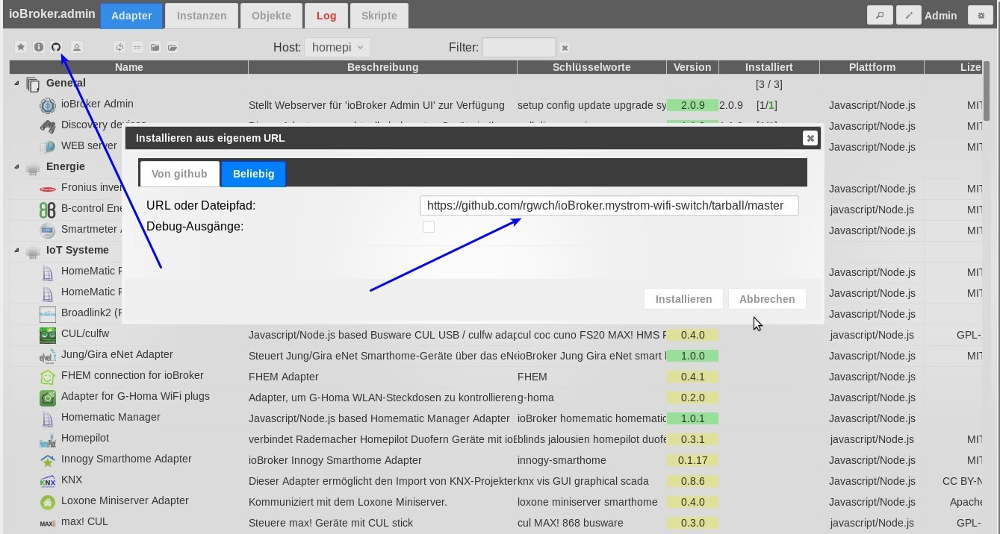

# ioBroker.mystrom-wifi-switch

Note: This is forked and derived from the ioBroker adapter template. So there'll be things from the original creators left.
Thanks to the ioBroker people!

## What it is

This adapter connects [myStrom WiFi Switches](https://mystrom.ch/wifi-switch) to ioBroker.

## Install

This adapter is not part of the official ioBroker distribution. So it will not show up in ioBroker admin's adapter list,
Install it from a shell. CD into /opt/iobroker and then

    npm install https://github.com/rgwch/ioBroker.mystrom-wifi-switch/tarball/master

or, install it as a custom adapter from the admin-ui:

The adapter should then be in the admin pages's list.

Click on the **+** sign on the right as usual to create an instance. The Config will ask you for the IP Address of the switch to manage, and for the polling interval in seconds.
That's all. If you have several switches, just create several instances.

## Use

Each instance will create a switchState and a switchPower object. SwitchState is true or false, switchPower is in Watts (and will always be 0 if  switchState is false, of course)

SwitchState is writeable.

####  1.0.0
 
* Added Datapoints for Temperature (Thanks to @hhindriks)
      
####  0.10.0
   
* added admin/index_m.html (compatibility with Admin3)
         
        
#### 0.8.3

* (rgwch) changed name to mystrom-wifi-switch, since no other mystrom devices are supported by now.

#### 0.7.0

* (rgwch) added power sensor

#### 0.6.0

* (rgwch) Converted to myStrom wifi switch adapter

#### 0.5.0

(vegetto) include vis widget

#### 0.4.0

(bluefox) fix errors with grunt

#### 0.2.0
* (bluefox) initial release

## License
The MIT License (MIT)

Copyright (c) 2017-2018 rgwch <rgw@rgw.ch>

Permission is hereby granted, free of charge, to any person obtaining a copy
of this software and associated documentation files (the "Software"), to deal
in the Software without restriction, including without limitation the rights
to use, copy, modify, merge, publish, distribute, sublicense, and/or sell
copies of the Software, and to permit persons to whom the Software is
furnished to do so, subject to the following conditions:

The above copyright notice and this permission notice shall be included in
all copies or substantial portions of the Software.

THE SOFTWARE IS PROVIDED "AS IS", WITHOUT WARRANTY OF ANY KIND, EXPRESS OR
IMPLIED, INCLUDING BUT NOT LIMITED TO THE WARRANTIES OF MERCHANTABILITY,
FITNESS FOR A PARTICULAR PURPOSE AND NONINFRINGEMENT. IN NO EVENT SHALL THE
AUTHORS OR COPYRIGHT HOLDERS BE LIABLE FOR ANY CLAIM, DAMAGES OR OTHER
LIABILITY, WHETHER IN AN ACTION OF CONTRACT, TORT OR OTHERWISE, ARISING FROM,
OUT OF OR IN CONNECTION WITH THE SOFTWARE OR THE USE OR OTHER DEALINGS IN
THE SOFTWARE.
